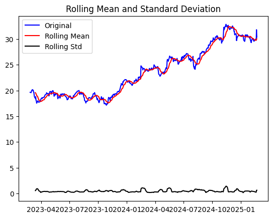

# Manulife's Daily Stock Price Forecasting

I developed an **ARIMA time series model** to forecast Manulife’s daily stock price, utilizing historical data up to the most recent trading day.

## Step 1: Data Acquisition via API

Driven by my strong interest in the financial services industry, I chose Manulife, Canada’s leading insurance company, to analyze and forecast the time trend of its daily stock price.

Using API integration, I extracted daily adjusted stock prices from January 1, 2023, to February 21, 2025, enabling real-time data retrieval for automated forecasting. The stock price has exhibited an upward trend since 2023.

## Step 2: Data Preprocessing

### Stationarity

The **12-day rolling mean** was selected to analyze stock price trends while reducing noise, smoothing out daily fluctuations while retaining meaningful short-term patterns. The analysis confirmed a **non-stationary** trend, which was further validated by the **Augmented Dickey-Fuller (ADF) test**.

To address this, I applied a **log transformation** to stabilize the variance and eliminate the trend. After transformation, the **12-day moving average** indicates improved stationarity.

### Train Test Split

The dataset was split into:

- **Training set:** 2023-01-01 to 2024-12-31
- **Testing set:** 2025

## Step 3: ARIMA Model Fitting

To build the ARIMA model, the optimal (p, d, q) parameters were selected:

- p (autoregressive order): Number of lag observations included in the model.
- d (degree of differencing): Number of times differencing is applied to make the data stationary by removing trends or seasonality.
- q (moving average order): Number of past forecast errors included in the model to correct predictions.

The ADF test confirmed that a one-time differencing (d = 1) was sufficient to achieve stationarity. To determine the optimal p and q, a stepwise search minimizing AIC was performed, identifying the best model as **ARIMA(0,1,2)**.

### Model Diagnostics

The diagnostic plots indicate that the model performs well:

- Residual errors exhibit uniform variance and fluctuate around a mean of zero.
- Residuals follow an approximately normal distribution centered around zero.
- No significant autocorrelation is detected in residuals, confirming the model's validity.

Overall, the ARIMA(0,1,2) model demonstrates a good fit for forecasting Manulife’s stock price.

## Step 4: Forecasting

Using the ARIMA(0,1,2) model, I implemented a rolling forecast with a 95% confidence interval on the test data, predicting **one step ahead** at a time. This ensures that each prediction is based on the most recent observed value, enhancing accuracy.

The forecasting results are shown below:

The detailed forecasted stock prices starting from 2025 are as follows:

The model achieved a Mean Absolute Error (MAE) of 0.35, indicating a relatively small deviation between predicted and actual stock prices.

## Step 5: Automated Forecasting Model

Using the ARIMA(0,1,2) model trained on the entire dataset up to February 21, 2025, I developed an automated next-day stock price forecasting model. The latest stock price data is dynamically retrieved via API, ensuring real-time predictions.

An example forecasted report is as follows:

"On 2025-03-12, the predicted stock price for Manulife is US\$30.27, with a lower bound of US\$29.05 and an upper bound of US\$31.53."
